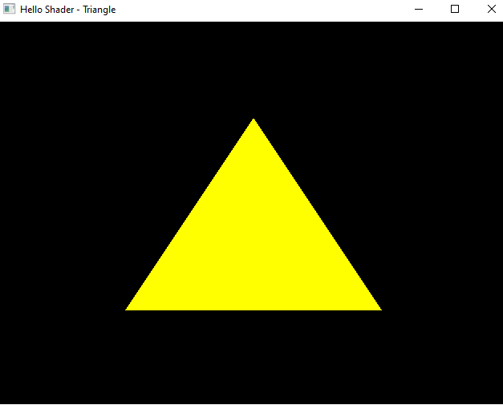

#### 🎯Objetivos:
- Compile e Link Vertex Shader e Fragment Shader
  
  ```cpp
void CompileAndLinkShaders()
{
    // 1. Criamos os nossos Objetos: 
    //    Programa = Vertex Shader + Fragment Shader    
    unsigned int programId = glCreateProgram();
    unsigned int vertexShaderId = glCreateShader(GL_VERTEX_SHADER);
    unsigned int fragmentShaderId = glCreateShader(GL_FRAGMENT_SHADER);
    
    // 2. Passamos as strings para com códigos GLSL
    //    para o tipo const char* = código fonte final
    std::string vsCode, fsCode;
    vsCode = ReadProgramSource("Main.vert");
    fsCode = ReadProgramSource("Main.frag");
    
    const char* vsFinalCode = vsCode.c_str();
    const char* fsFinalCode = fsCode.c_str();
   
    // 3. Copiamos o código fonte final 
    //para o Shader anteriormente criado
    glShaderSource(vertexShaderId, 1, &vsFinalCode, NULL);
    glShaderSource(fragmentShaderId, 1, &fsFinalCode, NULL);

    // 4. Compilamos os Shaders
    glCompileShader(vertexShaderId);
    glCompileShader(fragmentShaderId);

    // 5. Anexamos os Shaders compilados ao Programa
    glAttachShader(programId, vertexShaderId);
    glAttachShader(programId, fragmentShaderId);


    //6. Link
    glLinkProgram(programId);

    //7. Delete
    glDeleteShader(vertexShaderId);
    glDeleteShader(fragmentShaderId);


    //8. Utilizar o programa
     glUseProgram(programId);
}
```


#### Link para o vídeo no YouTube:

[](https://youtu.be/Cj6FBxf2dME)


<p align="center">
  
</p>
