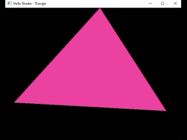

#### 🎯Objetivos:
- Uniforms - Rotacionar o Triângulo
  - glUniform1f
  - glUniformMatrix4fv
  - glm::rotate

```cpp
    int colorId = glGetUniformLocation(programId, "u_deltaTime");
    int matrixId= glGetUniformLocation(programId, "Matrix");
    float startTime = glfwGetTime();

    while (!glfwWindowShouldClose(window))
    {

        float currentTime = glfwGetTime();
        float dt = currentTime - startTime;

        glUniform1f(colorId, dt);
        glm::mat4 Rotation = glm::rotate(glm::mat4(1.f), glm::radians(60.f*dt), glm::vec3(0.f, 0.f, 1.f));

        glUniformMatrix4fv(matrixId, 1, GL_FALSE, glm::value_ptr(Rotation));
        
```


#### Link para o vídeo no YouTube:

[](https://youtu.be/cO5ZVmn6XPw)


<p align="center">
  
</p>
