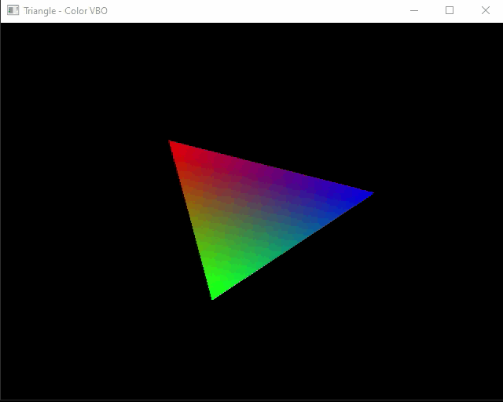

#### 🎯Objetivos:
- Reduzir a dimensão do triângulo
  - glm::scale
- Adicionar um buffer para armazenar as cores

```cpp
    float vertices[] =
    {
         +1.f,        +0.f , //+0.0f, +0.5f,
        -0.5f, +sqrt(3) / 2.f, //- 0.5f, -0.5f,
        -0.5f, -sqrt(3) / 2.f, //-0.5f, - 0.5f
    };
    
    GLubyte colors[] =
    {
        255, 0, 0,
        0, 255, 0,
        0, 0, 255
    };

    unsigned int positionVBO = 0, colorVBO=0; 

    glGenBuffers(1, &positionVBO);
    glGenBuffers(1, &colorVBO);
    
    //Ajustar position VBO
    glBindBuffer(GL_ARRAY_BUFFER, positionVBO);
    glBufferData(GL_ARRAY_BUFFER, sizeof(vertices), vertices, GL_STATIC_DRAW);

    glVertexAttribPointer(0, 2, GL_FLOAT, GL_FALSE, 2*sizeof(float), 0);
    glEnableVertexAttribArray(0);

    // Ajustar Color VBO
    glBindBuffer(GL_ARRAY_BUFFER, colorVBO);
    glBufferData(GL_ARRAY_BUFFER, sizeof(colors), colors, GL_STATIC_DRAW);

    glVertexAttribPointer(1, 3, GL_UNSIGNED_BYTE, GL_TRUE, 3*sizeof(GLubyte), 0);
    glEnableVertexAttribArray(1);

        
```


#### Link para o vídeo no YouTube:

[](https://youtu.be/dCd29TxN7XM)


<p align="center">
  
</p>

