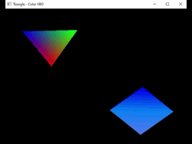

#### 🎯Objetivos:
- Adicionar um quadrado na cena


```cpp
    void CreateQuad()
{
    float vertices[] =
    {
        // Triangle 1
         +0.f, +1.f, 
         +0.f, -1.f,
         +1.f, +0.f,

        // Triangle 2
        +0.f, +1.f,
        -1.f, +0.f,
        +0.f, -1.f,
    };

    GLubyte colors[] =
    {
        // Triangle 1
        0, 125, 255,
        0, 125, 255,
        0,   0, 255,

        // Triangle 2
        0, 125, 255,
        85, 125, 255,
        0, 125, 255
    };


    glGenBuffers(1, &QuadPosVBO);
    glGenBuffers(1, &QuadColorVBO);

    //Fill position VBO
    glBindBuffer(GL_ARRAY_BUFFER, QuadPosVBO);
    glBufferData(GL_ARRAY_BUFFER, sizeof(vertices), vertices, GL_STATIC_DRAW);

    // Fill Color VBO
    glBindBuffer(GL_ARRAY_BUFFER, QuadColorVBO);
    glBufferData(GL_ARRAY_BUFFER, sizeof(colors), colors, GL_STATIC_DRAW);
    
}
        
```


#### Link para o vídeo no YouTube:

[](https://youtu.be/dCd29TxN7XM)


<p align="center">
  
</p>


