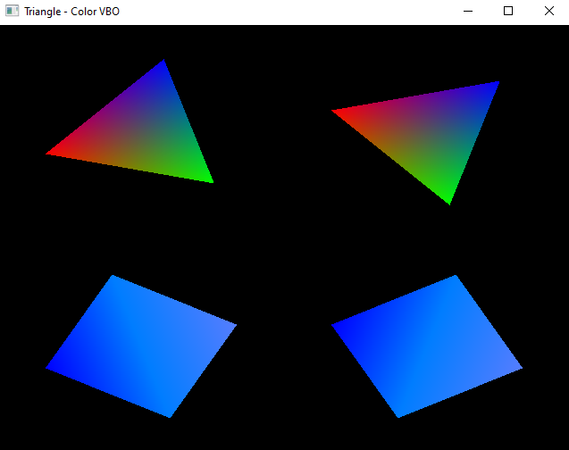

#### 🎯Matrizes:
- *glm::rotate*
- *glm::scale*
- *glm::translate(	detail::tmat4x4< T > const & 	m,
detail::tvec3< T > const & 	v 
)*
  - **m** : Input matrix multiplied by this scale matrix.
  - **v** :	Coordinates of a translation vector.
#### Link para o vídeo no YouTube:

  

