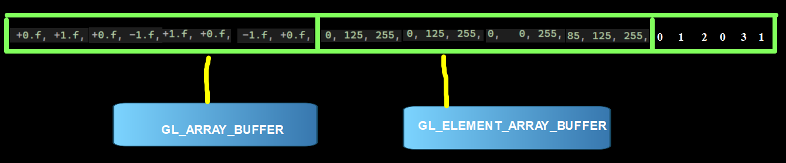

#### 🎯 Toda informação em um único Buffer

<p align="center">
  
</p>

```cpp

        glGenVertexArrays(1, &QuadVAO);
    glGenBuffers(1, &BufferId);

    glBindBuffer(GL_ARRAY_BUFFER, BufferId);
    glBufferData(GL_ARRAY_BUFFER, 
        sizeof(vertices) + sizeof(colors)+ sizeof(indices), 0, GL_STATIC_DRAW);

    unsigned int currentOffSet = 0;
    glBufferSubData(GL_ARRAY_BUFFER, currentOffSet,
        sizeof(vertices), vertices);

    currentOffSet += sizeof(vertices);
    glBufferSubData(GL_ARRAY_BUFFER, currentOffSet,
        sizeof(colors), colors);

    currentOffSet += sizeof(colors);
    glBufferSubData(GL_ARRAY_BUFFER, currentOffSet,
        sizeof(indices), indices);      
        .
        .
        .
 glDrawElements(GL_TRIANGLES, 6, GL_UNSIGNED_INT,(void*) indexOffSet);
        
```

#### Link para o vídeo no YouTube:

[](https://youtu.be/HBKfZ1ADRzY)


