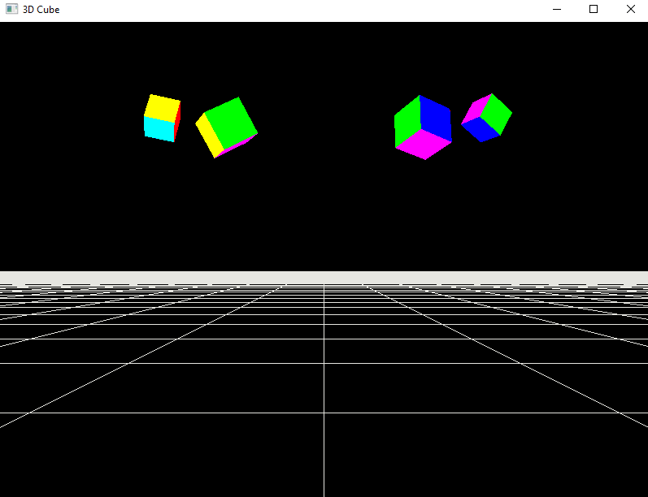

#### 🎯Objetivos:
- Criar múltiplos shaders: *Minor.vert* e *Main.vert*
  - *Minor.vert* atuará no Terreno
  - *Main.vert* atuará no Cubo
```cpp
    //Model Matrix  with Frequent Changes
    Shader mainShader("Main.vert", "Main.frag");
    mainShader.CreateShaders();

    //Model Matrix  with Minor Changes
    Shader minorShader("Minor.vert", "Main.frag");
    minorShader.CreateShaders();
       
```


#### Link para o vídeo no YouTube:

[](https://youtu.be/jBo3ZecM_gs)


<p align="center">
  
</p>
